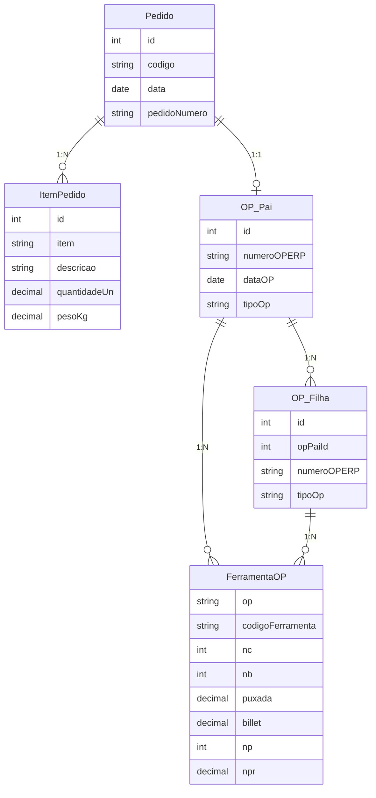

# MESK Frontend

## Instalação e execução

```bash
yarn install
yarn add webpack webpack-cli webpack-dev-server html-webpack-plugin mini-css-extract-plugin terser-webpack-plugin compression-webpack-plugin webpack-bundle-analyzer path @babel/core @babel/preset-env @babel/preset-react babel-loader webpack-hot-middleware
```

**Rodar o projeto:** `yarn start`  
**Build:** `yarn build2` → pasta `dist`

---

## Módulos

### Pedidos

- **Visão geral:** Gestão de pedidos provenientes majoritariamente da integração com TOTVS.
- **Regras de negócio:**
  - Usuário **não pode:** criar pedidos, excluir pedidos, excluir itens do pedido.
  - Usuário **pode:** visualizar pedidos, editar campos permitidos, configurar itens via modal (botão "Configurar" por item).
- **Campos do pedido:** Código (não editável, gerado automaticamente), Data do Pedido, Pedido Nº (TOTVS), Situação (dropdown), Cliente (pesquisa), Observação.
- **Itens:** Carregados via integração; edição controlada pelo modal "Configurar" com DynamicForm.

### Ordem de Produção (OP)

- **Visão geral:** OP sempre vinculada a um Pedido. Dois tipos: **OP Pai** (representa o pedido principal) e **OP Filha** (produções parciais).
- **Regras de negócio:**
  - **OP Pai:** criada automaticamente a partir do Pedido (fluxo "Cadastrar OP" em Pedidos); **não pode** ser excluída.
  - **OP Filha:** criada manualmente na tela de OP; **pode** ser excluída; sempre vinculada a uma OP Pai.
- **Campos da OP:** Número da OP (EMS/TOTVS), Data do Registro, Situação, Item a Produzir (Código/Descrição), Quantidade a Produzir, Cliente (dropdown), Nº Pedido do Cliente (dropdown), Observações.
- **Grid Ferramentas da OP:** OP, Código da Ferramenta, NC, NB, Puxada, Billet, NP, NPR.

---

## Modelo de dados (conceitual)



- **Pedido** 1:N **Itens do Pedido** (sem exclusão de itens pelo usuário).
- **Pedido** 1:1 **OP Pai** (OP criada a partir do pedido).
- **OP Pai** 1:N **OP Filha** (OP Filha vinculada por `opPaiId`).
- **OP** 1:N **Ferramentas da OP** (grid NC, NB, Puxada, Billet, NP, NPR).

---

## Integração TOTVS (prevista)

- **Pedidos:** Busca de pedido por número (Buscar Pedido do Totvs); sincronização de itens; criação de OP Pai a partir do pedido (Cadastrar OP).
- **Ordem de Produção:** Busca de OP no ERP (Buscar OP do ERP); alinhamento de campos e ferramentas com TOTVS.

---

## Arquitetura do frontend

- **Formulários:** DynamicForm + `formConfig` (array de seções e questions).
- **Modais:** Ant Design Modal + DynamicForm para formulários (ex.: modal Configurar item do pedido).
- **Grids:** PaginatedTable para listagens; Table do Ant Design para grids internos (itens, ferramentas).
- **Componentização:** Pages, Components, Services, Hooks; reutilização de ActionButtons, DynamicForm, ViewForm.
